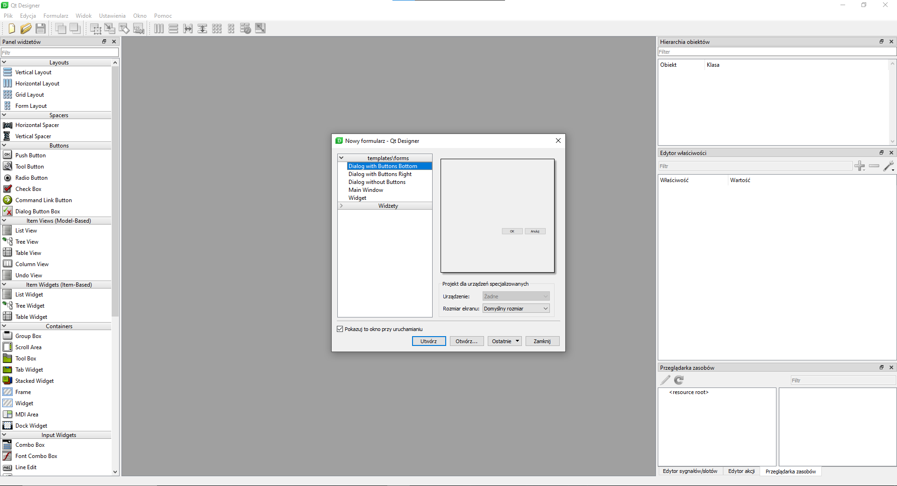
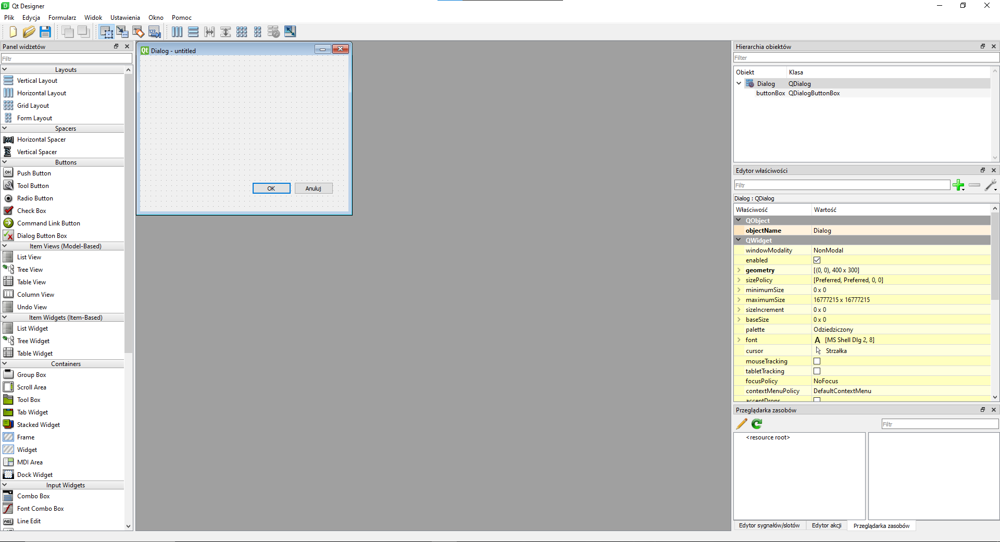
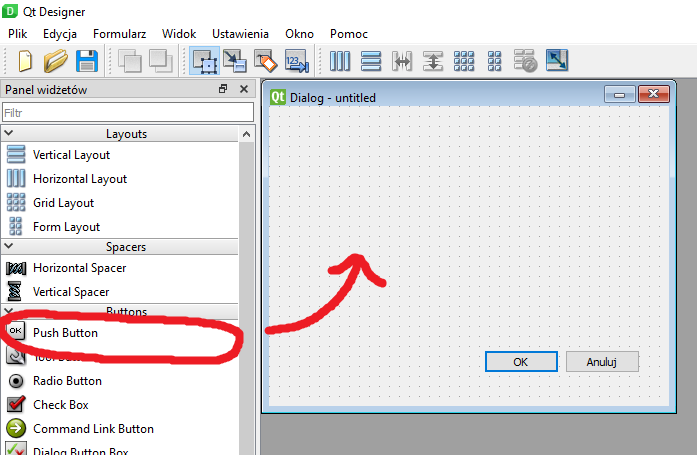
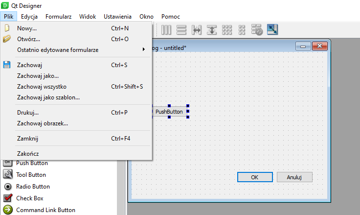

W tym zadaniu nauczymy się, jak zainstalować Qt Designer, stworzyć pierwszy projekt oraz podłączyć akcje do elementów interfejsu użytkownika. Qt Designer jest narzędziem do projektowania graficznych interfejsów użytkownika (GUI) w aplikacjach Qt.

Część 1: Instalacja Qt

Odpal cmd.

wpisz komende "pip install --upgrade setuptools"

następnie "pip install  qt5-tools designer"

w tym momecie Qt Designer został pobrany i można go włączyć za pomocą komendy.
"qt5-tools designer"

Część 2: Tworzenie pierwszego projektu w Qt Designer

Po włączeniu wyświetla nam się takie okno

Pozwala nam ono wybrać podstawowe szablony. Po wciśnięciu "Utwórz" mamy stworzony projekt,
który możemy edytować.

By dodać element do naszego szablonu wystarczy przeciągnąć go z lewej listy na nasz projekt

By zapisać nasz projekt. Wciskamy przycisk "Zachowaj" umieszczony w menu "Plik" (można
również zastosować skrót Ctrl+S)

Część 3: Eksportowanie pliku QML

Nie ma takiej możliwości w zakładce "File"

